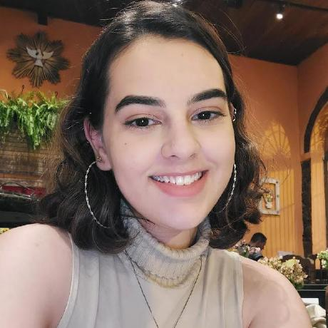
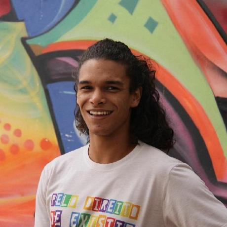

    <h1 class="title">Bote</h1>
    
O Bote é um projeto que propõe criar uma forma de gerenciamento de envio de conteúdos, de forma a facilitar a gestão de um grande número de destinatários. Desta forma, foi criado um sistema de professor e aluno, onde o professor é o remetente, responsável por cadastrar os materiais a serem enviados para uma lista de alunos determinados por ele. Essa ferramenta disponibiliza os conteúdos de forma gradual, a medida que o aluno evolui no curso. O Bote possui o papel de transportar os conteúdos para todos os destinos.

<h2 class="title">Contribuidores</h1>

    

        
    

    

        <h3 class="title1">Ana Letícia</h1>
        
https://github.com/analeticiaa

    

    

        
    

    

        <h3 class="title1">Arthur Augusto</h1>
        
https://github.com/arthur-augusto

    

    

        
    

    

        <h3 class="title1">Brunna Louise</h1>
        
https://github.com/brunna-martins

    

    

        
    

    

        <h3 class="title1">Caetano Santos</h1>
        
https://github.com/caeslucio

    

    

        
    

    

        <h3 class="title1">Larissa Gomes</h1>
        
https://github.com/larigs

    

    

        
    

    

        <h3 class="title1">Otávio Maya</h1>
        
https://github.com/knz13

    

