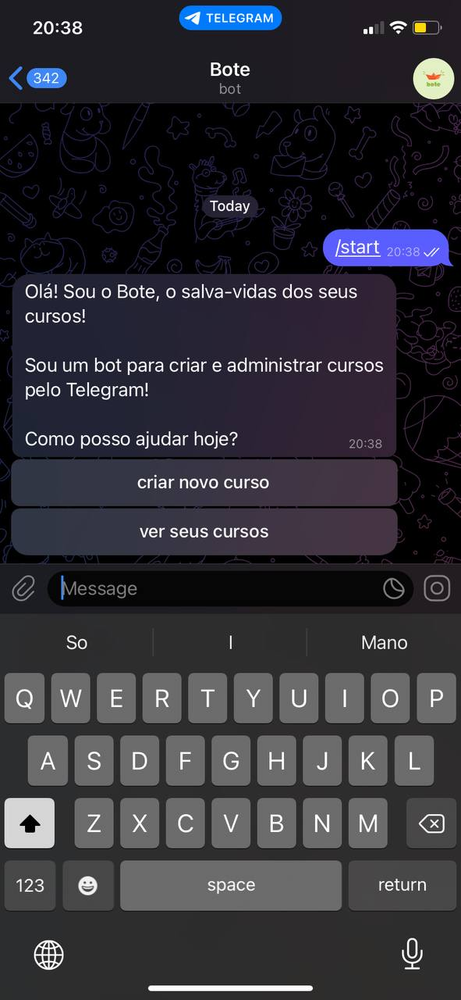
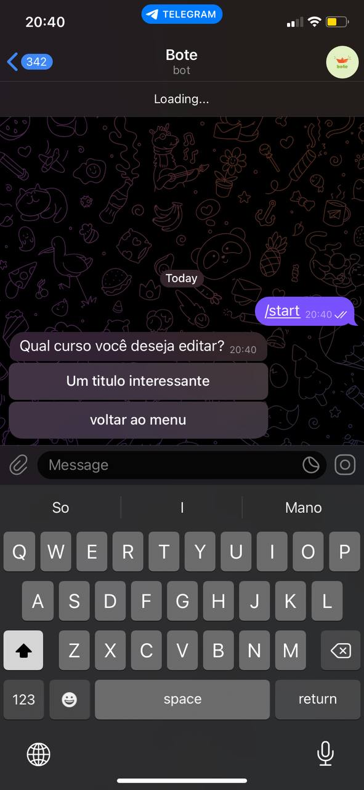
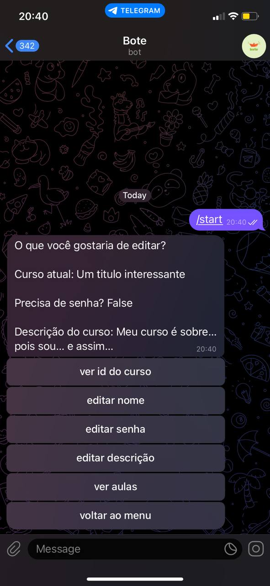
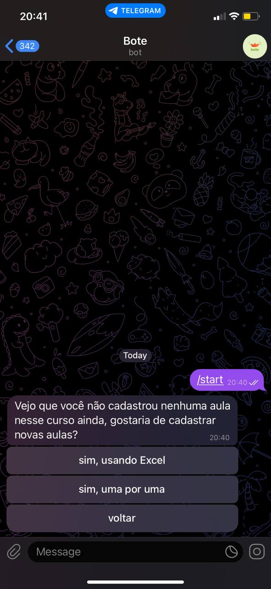
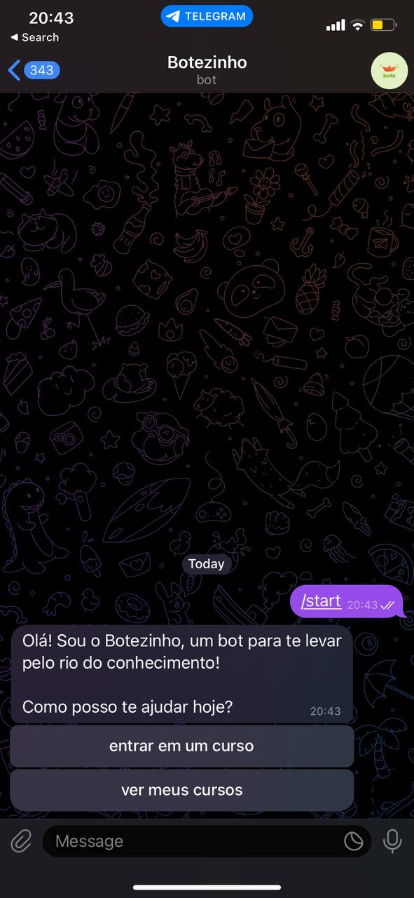
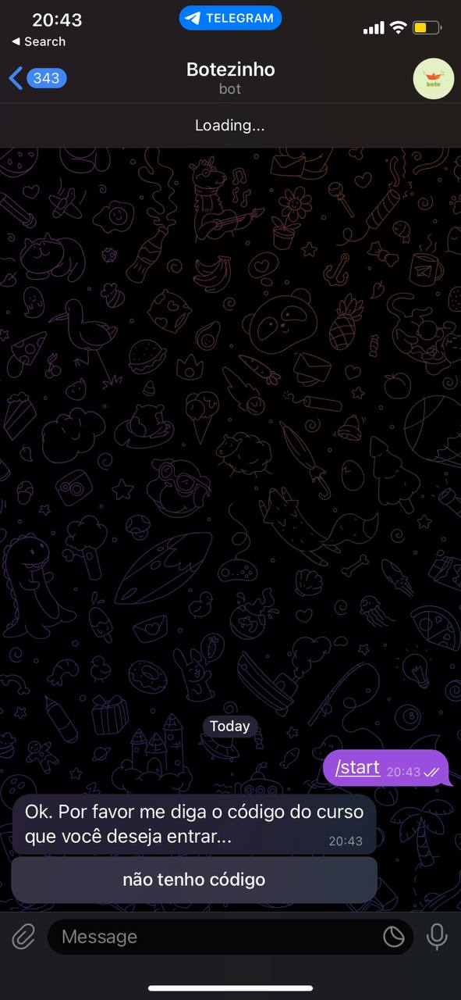
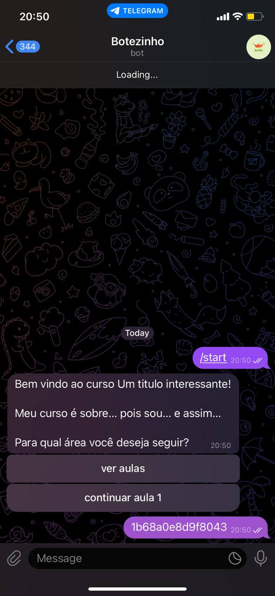

    <h1 class="title">Bote</h1>
    
O projeto Bote visa criar um novo formato de curso por meio de mensagens. Para isso, foram criados o Bote e o Botezinho, dois bots que podem ser acessados pelo Telegram. O Bote é o responsável pelo cadastro dos cursos e conteúdos, enquanto o Botezinho é o bot responsável pela disponibilização dos conteúdos e acompanhamento dos usuários registrados nele. O sistema foi construído de forma direta e intuitiva, para facilitar todas as interações entre o usuário e o bot. 

    

        

            
        

        

            
        

        

            
Para iniciar a utilização do Bote, basta enviar /start para o bot @GerenciadorDeCursosBot no Telegram, onde será realizado o cadastro do curso. 

        

        

            
Além do cadastro, o Bote também permite alterar os cursos já criados.

        

        

            
        

        

            
        

        

            
        

        

            
Após a criação do curso, é oferecido a opção do formato de envio dos conteúdos. Em seguida, o Botezinho está pronto para ser usado para acessar esse curso.

        

        

            
        

        

            
        

        

            
        

        

            
Será disponibilizado um código ao criador do curso, para ser disponibilizado a quem for se inscrever no curso. O usuário do Botezinho poderá decidir qual aula gostaria de assistir ou continuar assistindo uma a atual.

        

    

